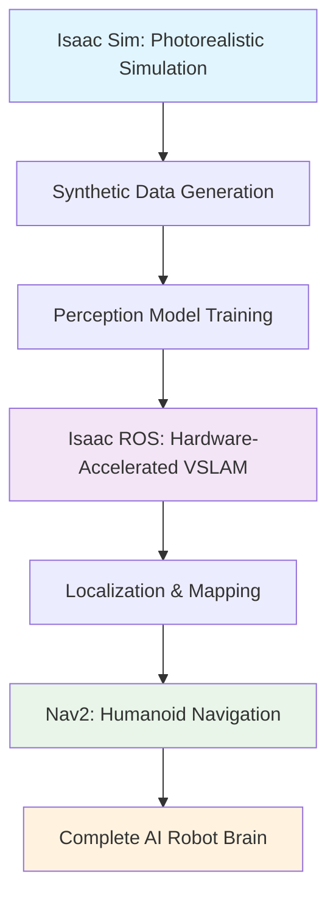

## Perception → Localization → Navigation Flow

This diagram illustrates the core architecture of the AI Robot Brain:

1. **Isaac Sim** provides photorealistic simulation environment
2. **Synthetic Data Generation** creates training datasets with domain randomization
3. **Perception Models** are trained on synthetic data for transfer to real world
4. **Isaac ROS** provides hardware-accelerated VSLAM capabilities
5. **Localization & Mapping** creates environmental understanding
6. **Nav2** handles humanoid-specific navigation and path planning
7. **Complete AI Robot Brain** integrates all components for intelligent behavior